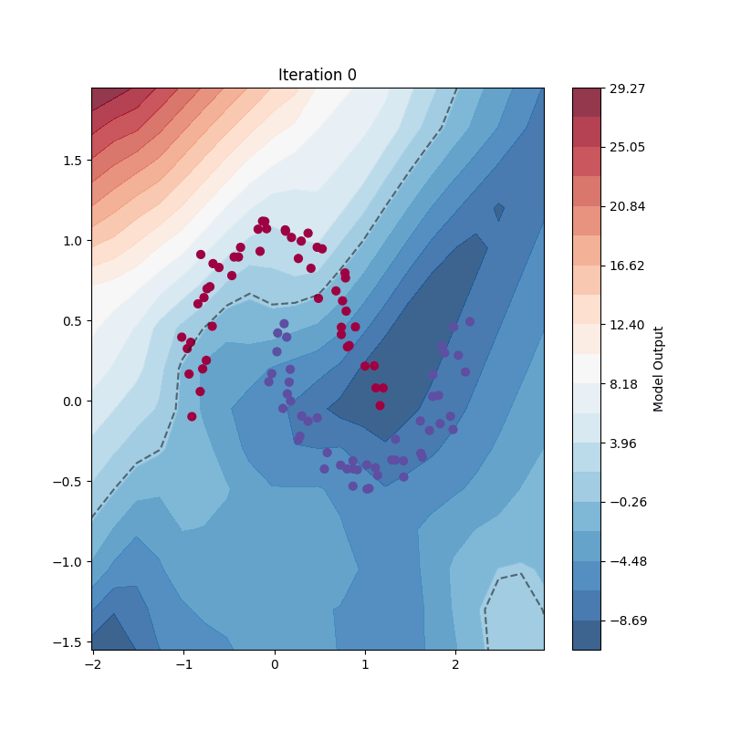

# SimpleGrad

Minimal autograd implementation expanding micrograd to work with matrix operations and tensors.

Based on:
1. [karpathy's micrograd](https://github.com/karpathy/micrograd)
2. Michael Nielsen's [Neural Networks and Deep Learning book](http://neuralnetworksanddeeplearning.com/)
   - [Original repo](https://github.com/mnielsen/neural-networks-and-deep-learning)
   - [Python 3 fork](https://github.com/unexploredtest/neural-networks-and-deep-learning.git)


```
└── SimpleGrad
    ├── simplegrad/    # Core library implementation
    ├── demos/         # Example usage and demonstrations
    └── data/          # Example datasets
```

## Decision Boundary Animation
[demo/decision_boundary.ipynb](demos/decision_boundary.ipynb)


## MNIST Results
[demo/mnist.ipynb](demos/mnist.ipynb)


